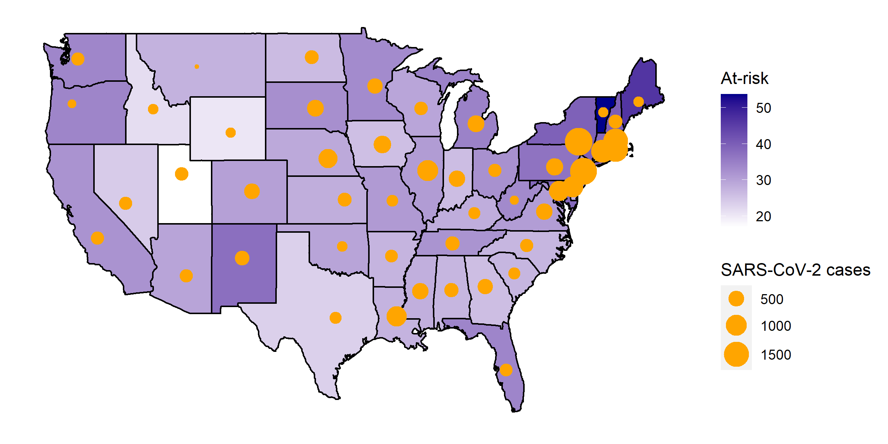

# Projecting primary care shortages secondary to the COVID-19 pandemic

## Purpose

## Visualization

 

Each state is shaded by the number of primary care physicians over age 60 practicing there, corresponding to the legend titled "At-risk".
Each state also has a single red dot whose radius corresponds to the number of cases of SARS-CoV-2 in that state as of 4 June 2020, corresponding to the legend titled "Current".

## Data dictionary

* **generate.R:** R script that generates the U.S. bubble map.
* **covid-cases.csv:** number of SARS-CoV-2 cases in all U.S. states, as of 4 June 2020.
* **state-data.csv:** state-level AAMC workforce and geographical data.
* **ihme-projection.csv:** projected number of SARS-CoV-2 cases in all U.S. states by 1 October 2020.

For more details, see `data-dictionary.txt`.

## Problems?

Please submit questions, comments, suggestions, and bug reports by opening an issue [here](https://github.com/rrrlw/covid-primary-care/issues).
